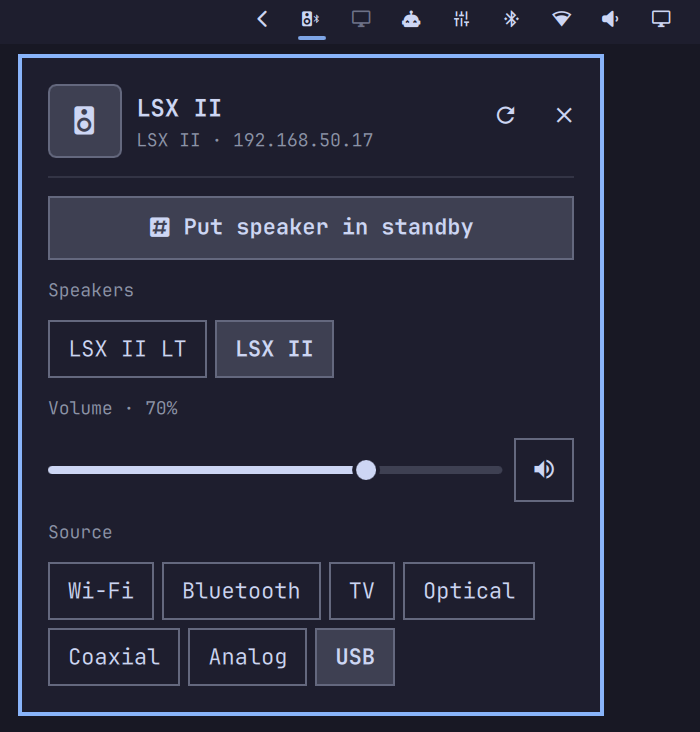

# Kefctl

Native KEF speaker controls powered by `kefctl`.



Left-click the bar icon to open native controls for speaker selection, volume,
mute, and source. Right-click opens the full `kefctl` TUI for advanced
settings.

## Requirement

Install [`kefctl`](https://aur.archlinux.org/packages/kefctl) from the AUR
(`kefctl` 0.7.0 or newer). This plugin uses its `panel` command as the local
KEF API and discovery backend.

## Install

After this repository is pushed to GitHub:

```bash
omarchy plugin add https://github.com/douglas/omarchy-kefctl.git --enable
```

## Development

Validate the plugin folder with:

```bash
omarchy plugin validate .
qmllint -I "$OMARCHY_PATH/shell" Widget.qml
```
